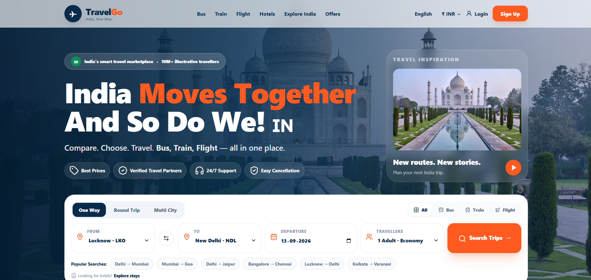
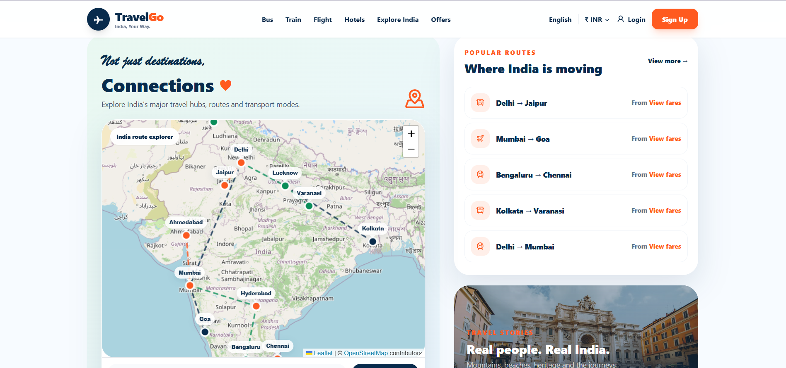
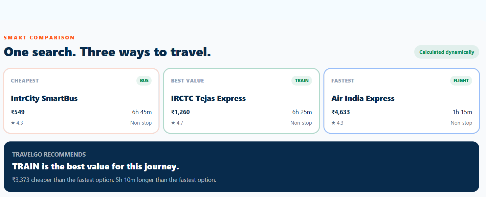
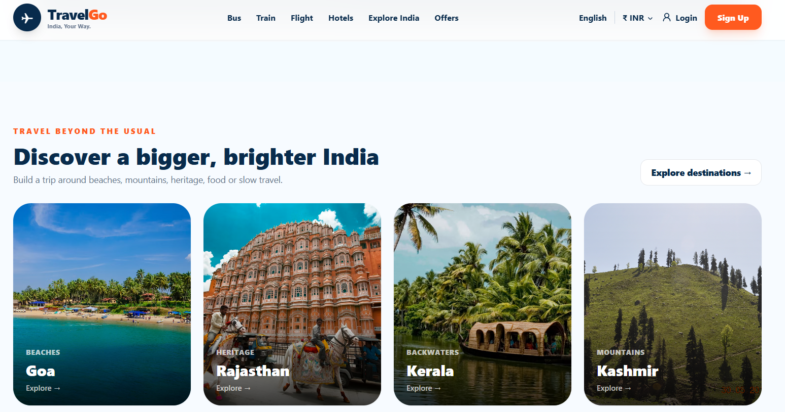
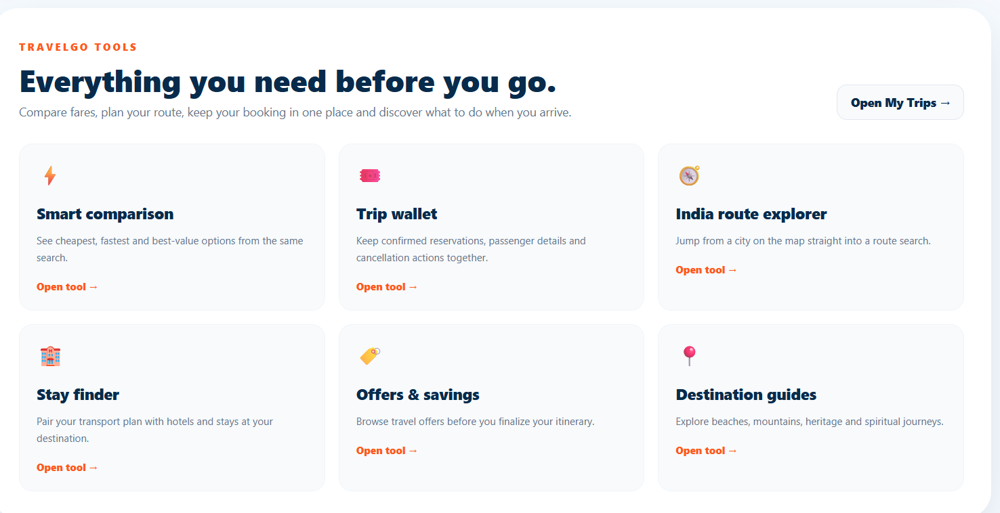

# ✈️ TravelGo India

### 🇮🇳 India Moves Together. And So Do We!

TravelGo India is a responsive full-stack Indian travel comparison and reservation platform built with **Next.js, React, TypeScript, Tailwind CSS, Prisma and Framer Motion**.

It helps travellers search, compare and reserve **buses, trains and flights** through a modern, responsive and easy-to-use travel experience.

---

## 📸 Project Preview

### 🏠 Homepage



### 🗺️ India Route Explorer



### ⚖️ Smart Comparison



### 🏞️ Destinations



### 🧰 TravelGo Tools



---

## ✨ Features

### 🔎 Travel Search & Comparison

- Search buses, trains and flights
- Compare multiple travel options
- Compare fares, departure times and duration
- View operator/service names
- View fare source information
- Filter and sort travel results
- Responsive search experience

### 🚌 Bus Travel

- Bus service listings
- Operator information
- Departure and arrival details
- Fare comparison
- Seat selection flow

### 🚆 Train Travel

- Train service listings
- Train numbers
- Departure and arrival information
- Fare comparison
- Seat selection flow

### ✈️ Flight Travel

- Flight listings
- Airline information
- Flight numbers
- Departure and arrival details
- Fare comparison

### 💺 Booking Experience

TravelGo provides a complete website reservation journey:

```text
Search
   ↓
Compare
   ↓
Select Trip
   ↓
Choose Seat
   ↓
Passenger Details
   ↓
Checkout
   ↓
Reservation Confirmation
   ↓
QR / PDF
   ↓
Dashboard
   ↓
Cancellation

Features include:
Interactive seat selection
Passenger details
Checkout
Reservation confirmation
QR code generation
PDF reservation generation
Dashboard
Reservation cancellation
🗺️ Interactive India Map
Interactive India route explorer
Leaflet-powered map
React Leaflet integration
OpenStreetMap tiles
Geographic latitude/longitude based city markers
Route visualisation
Bus, train and flight route differentiation

Major destinations represented include:

Srinagar
Amritsar
Delhi
Jaipur
Lucknow
Varanasi
Ahmedabad
Kolkata
Mumbai
Hyderabad
Goa
Bengaluru
Chennai
Kochi
🏞️ Destinations

Explore popular Indian destinations including:

Kashmir
Goa
Rajasthan
Kerala
Delhi
Mumbai
Bengaluru
Chennai
Varanasi
Jaipur
🏨 Travel Discovery
Hotels
Destination discovery
Travel offers
Search history
Favourite trips
Personal dashboard
🛠️ Admin
Admin dashboard
Analytics
Travel/search insights
Application management features
🔐 Authentication
Login
Signup
Authentication support
Protected application areas
💰 Travel Data

TravelGo uses real operator/service names and public fare/timetable snapshots where public listings were available.

The Lucknow → New Delhi route includes public listing snapshots covering:

🚌 Bus
Gola Bus Service
Laxmi Holidays Pvt Ltd
Metrobus
IntrCity SmartBus
🚆 Train
Vande Bharat Express 22425
IRCTC Tejas Express 82501
ANVT Double Decker 12583
ANVT Humsafar 12571
KYQ BGKT Express 15624
✈️ Flight
IndiGo 6E2190
Air India Express IX2173
IndiGo 6E6480

Travel fares, schedules and availability can change continuously. The displayed information should therefore be treated as public/reference snapshots rather than guaranteed live inventory.
🗺️ India Route Explorer
The map is built using:
Leaflet
React Leaflet
OpenStreetMap
Geographic latitude/longitude coordinates
Travel routes are visually differentiated by travel type:
🚌 Bus
🚆 Train
✈️ Flight
The map uses geographic coordinates rather than manually positioned screen coordinates, allowing city markers to remain aligned with their actual locations.
OpenStreetMap attribution is displayed within the map interface.
🎨 User Experience

TravelGo is designed around a modern Indian travel experience with:
🇮🇳 Indian travel identity
📱 Mobile-first responsive layout
💻 Desktop support
✨ Framer Motion animations
⚡ Fast interactions
🧭 Clear navigation
🔎 Simple search
⚖️ Easy comparison
💺 Guided booking flow
🎯 Clean travel-focused interface

🧰 TravelGo Tools
The platform includes supporting travel utilities and experiences such as:
Travel search
Route exploration
Trip comparison
Offers
Destination discovery
Hotels
Search history
Favourite trips
Dashboard
Reservation management

🛠️ Tech Stack

Frontend
Next.js 15
React 19
TypeScript
Tailwind CSS
Framer Motion
Lucide React

Backend
Next.js API Routes
Prisma ORM
PostgreSQL-ready architecture
NextAuth authentication

Maps
Leaflet
React Leaflet
OpenStreetMap

Forms & Validation
React Hook Form
Zod

Data Visualisation
Recharts

Documents & QR
pdf-lib
QRCode

Testing
Vitest
Playwright

📂 Project Structure
travelgo-india/
│
├── app/
│   ├── api/
│   ├── booking/
│   ├── dashboard/
│   ├── destinations/
│   ├── hotels/
│   ├── offers/
│   ├── search/
│   ├── trips/
│   ├── admin/
│   ├── login/
│   └── signup/
│
├── components/
│   ├── india-map.tsx
│   ├── india-map-client.tsx
│   ├── search-box.tsx
│   └── ...
│
├── lib/
│   ├── data/
│   ├── auth/
│   └── ...
│
├── prisma/
│   └── schema.prisma
│
├── public/
│
├── tests/
│
├── 01-homepage.png
├── 02-india-route-explorer.png
├── 03-smart-comparison.png
├── 04-destinations.png
├── 05-travelgo-tools.png
│
├── .env.example
├── .gitignore
├── next.config.ts
├── package.json
└── README.md
🚀 Run Locally
1. Clone the repository
git clone https://github.com/abhishek-mishra16/Travelgo.git
2. Enter the project directory
cd Travelgo
3. Install dependencies
npm install
4. Configure environment variables
Create a local environment file:

.env.local

Configure the required environment variables for your local setup.
Do not commit .env.local to GitHub.

5. Start the development server
npm run dev
6. Open the application
http://localhost:3000

🧪 Testing

Run the test suite:
npm test

Create a production build:
npm run build

Start the application locally:
npm run dev

🔌 API Architecture

TravelGo uses server-side API routes for application functionality including:

Search
Trips
Seats
Bookings
Payments
Offers
Favourites
Search history
Authentication
Admin analytics
PDF generation
Cancellation

The architecture is designed so authorised third-party travel provider APIs can be integrated later without replacing the customer-facing booking experience.

🔐 Security

The project follows common application security practices including:

Environment variables for secrets
.env.local excluded from Git
Server-side API routes
Authentication support
Input validation with Zod
Prisma database layer
No payment credentials stored in the repository

📊 Data & Reservation Disclaimer

Public travel websites continuously change fares, schedules and availability.

TravelGo does not scrape or bypass provider systems.

The current application uses public/reference travel data and website reservation logic.

The checkout creates a TravelGo website reservation. It does not submit an actual ticket purchase to IRCTC, an airline or a bus operator, and it does not issue an operator ticket.

For production-grade live search, live seat availability and real ticket booking, authorised provider APIs would need to be connected.

🌐 Deployment

TravelGo is designed for modern Next.js hosting environments.

A typical production architecture can use:
Next.js
   +
PostgreSQL
   +
Prisma
   +
Environment Variables
   +
Authorised Travel APIs
Before production deployment, configure the required:

Database
Authentication
Environment variables
Authorised travel provider integrations
💡 Why TravelGo?

TravelGo combines multiple parts of the Indian travel journey into one platform:
Discover
   +
Search
   +
Compare
   +
Choose
   +
Reserve
   +
Manage
Instead of switching between multiple travel websites, users can explore travel options through a single unified interface.

⭐ Project Highlights
Full-stack Next.js application
TypeScript-based development
Responsive modern UI
Interactive India map
Bus + Train + Flight comparison
End-to-end reservation flow
Seat selection
QR/PDF generation
Authentication
Dashboard
Admin analytics
API-ready architecture
PostgreSQL + Prisma ready
Automated testing support
Production-oriented project structure

👨‍💻 Author
Abhishek Mishra

GitHub:

https://github.com/abhishek-mishra16

Repository:

https://github.com/abhishek-mishra16/Travelgo

⭐ Support the Project

If you find TravelGo India interesting or useful, consider giving the repository a ⭐ on GitHub.

